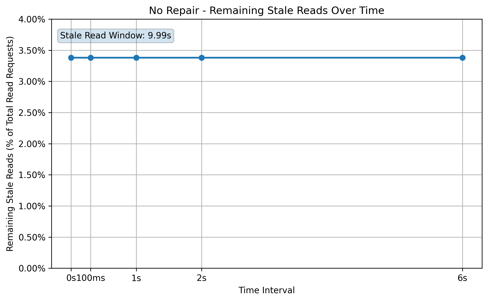
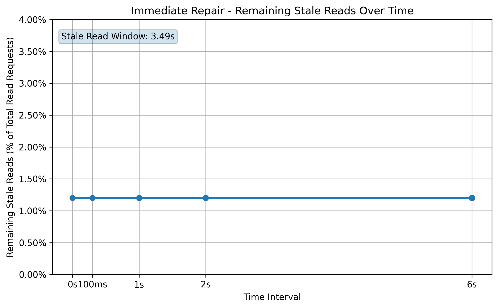
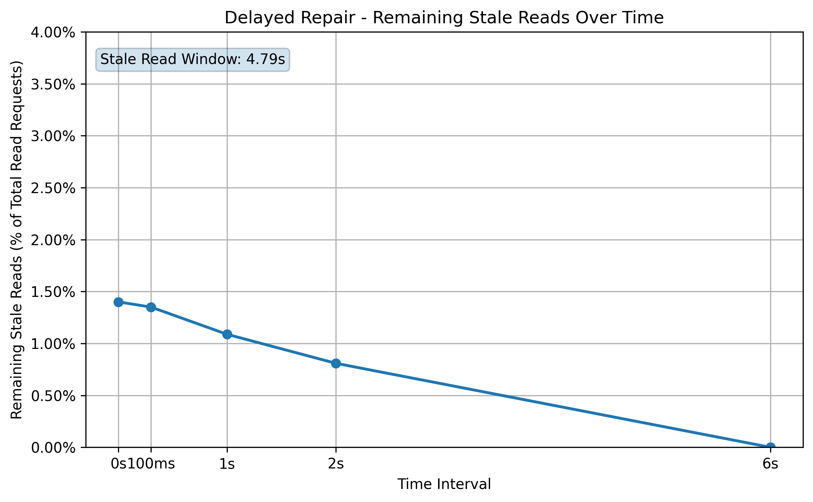

# Distributed Cache in Go

## Overview
A distributed in-memory cache implemented in Go featuring:
- consistent hashing
- replication
- failure detection
- node repair
- replica read fallback

## Features
- Consistent hashing
- Configurable replication factor
- Health-check-based failure detection
- Dynamic ring rebuilds
- Best-effort replication
- Node repair on recovery
- Replica read fallback
- Metrics collection

## Architecture


### Node Responsibilities
* Maintain hash ring
* Perform health-checks triggering dynamic ring rebuilds
* Handle incoming requests from client, coordinator, or peer nodes
* Access concurrency-safe in-memory hash table
* If coordinator for a request, perform coordinator responsibilities including
  * Best-effort replication based on configurable replication factor
  * Replica read fallback
* Metrics collection and dumps

### Coordinator Behavior
* For put requests, computes replica set and fans-out the write to each replica. Response to client is dependent on configurable write_mode discussed later. 
* For get requests, employs read fallback behavior. This entails computing replica set and trying read from first replica. If that fails, try next replica. Continue for all replicas. If any replica succeeds, return its result. But if all replicas failed, respond to client with an error. 

### Replication Flow
* First compute the replica-set for the key 
* Then fan-out in parallel to each replica (includes primary) in replica set and issue a put request to each. 
  * If the coordinator is in the replica set, it will perform a local put instead of making an extra network request to itself. 
  * How it responds to client is dependent on the configured write mode:
    * strict mode: Succeeds the put request only if all replicas succeeded. Better for high-consistency requirements. 
    * best effort mode: Succeeds the put request if first replica (primary) succeeded, even if some other replicas failed. If first replica fails, the operation may still write the data to other replicas. Better for high-availability requirements. 
    * A comparison and tradeoffs between the two write modes will be explained further below. 

## System Design

### Hash Ring
* Chosen hashing function is [xxhash](https://github.com/cespare/xxhash) for its speed and relatively even distribution. 
* Hash ring kept in-memory as a concurrency-safe array of node structs sorted by their hash value. 
* Computing Replica Set:
  * First, the key is hashed. 
  * Then we compute the number of **effective replicas** as the minimum of the configured replication factor and the number of (healthy) nodes in the hash ring. i.e. `effective_replicas=min(replication_factor, num_nodes_in_ring)`. The reason for this is to handle scenarios when one or more nodes are unhealthy and have been removed from the hash ring, and there is no way to meet the configured replication factor. 
  * Then do a modified binary-search of the key on hash ring array to find the first replica. Then walking clockwise to find the other replicas. In total there will be `effective_replicas` replicas in the set.
* If a node leaves or joins the cluster, hash ring is rebuilt in concurrency-safe manner. 

### Replica Selection
* If a node is repeatedly failing health checks, it will be removed from each node's local view of the hash ring. 
* Replica selection continues as normal, without the unhealthy node in the hash ring. A new node (the next node moving clockwise) replaces the unhealthy one.  

### Repair
* When a dead node comes back alive, it contains no data, which will introduce stale reads into the system if not addressed. 
* We address this by having the recovered node pull repair snapshots from each of its peers. We let each peer node calculate what subset of its data the recovered node should contain (based on the keys for which the recovered node is in the replica set), and respond with that data. 
* The recovered node merged the repair data received from its peers. If one or more peers are unavailable, the repair is still likely to succeed as the data on the unavailable peers will have been replicated on other nodes. 
* The timing of **when** repair takes place during node recovery matters for minimizing stale reads. This will be discussed later. 

### Membership
* For simplicity, each node initially knows about all the other nodes in the cluster through a command-line argument of node hostnames. 
* Each node issues periodic health-checks every 4 seconds to all other nodes in the cluster to determine membership. 
* Any nodes that have failed health checks for more than 8 seconds are considered unhealthy and are removed from the hash ring. 
* If a previously unhealthy node succeeds a health check, it is considered healthy and rejoins the hash ring. 
* This approach is simple enough for a relatively small set of nodes. For large clusters with hundreds or thousands of nodes it would become necessary to implement Gossip protocol. 

## Failure Handling

### Failure Detection
* As discussed already, node failure detection happens through health checks. Once a node is considered dead, requests will no longer be routed to it, effectively "skipping" it when computing replica sets for gets and puts. 

### Repair Timing
* As already mentioned, when a dead node comes back online, it needs to repair the data it should have, otherwise the system will respond with many stale reads once the recovered node rejoins the cluster. Experiments showed that the timing of when this repair happens reveals different stale windows and has consistency implications. 
1. Immediate Repair: If the repair happens immediately when the node comes back online, there is a time window between when the repair completed and when the node rejoins the cluster (other nodes see health checks pass). During this time window, the recovered node misses out on writes and never gets them. This results in stale reads for those keys once the node rejoins the cluster. Experimental results confirmed this. 
2. Delayed Repair: If we delay repair until **after** we're confident the recovered node has rejoined the cluster, it doesn't miss out on any writes, solving the problem above. However, there is another time window between when the node rejoins the cluster and the time when repair occurs. During this time window, reads may be routed to the recovered node when it has no data yet, resulting in stale reads during this window. However, unlike in Immediate Repair, the stale reads are bounded until repair occurs, whereas in Immediate Repair, the stale reads can occur indefinitely (experimentally verified). This makes Delayed Repair preferable and provides greater eventual consistency which is why it was chosen for this system. 

## Consistency Model
* The system provides eventual consistency semantics under single-node failure scenarios. This is a consequence of the following:

### Best Effort Writes
* In best-effort write mode, we attempt to write to all replicas, and succeed if the first replica (primary) succeeded. But even if the first replica failed, the other replicas may have written the data. So if the first replica went dead, it can repair that data when it comes back online. 

### Replica reads
* The system serves highly-available reads, succeeding with the result of the first replica that gives us a response, and only failing if all replicas failed to respond. This has a limitation which is that replicas could disagree on the latest write, and in that case these semantics would simply respond with the result of the first replica that responded. A more robust system would include quorum reads and vector clocks, but those are out of the scope of this project. 

### Convergence After Repair
* With the delayed repair strategy outlined above, the system is eventually consistent under single-node failure scenarios. There is a limited stale read time window after which the reads converge to the correct value. This time window is dependent on the health-check period and repair delay, and can be seen in the experimental results below. 

# Experimental Results

## Experiment 1: Stale Read Windows
* This first experiment evaluates the eventual-consistency properties of the system under single-node failure with 3 different setups:
#### Setup 1: No repair on node recovery (baseline)
#### Setup 2: Immediate repair on node recovery
#### Setup 3: Delayed Repair on node recovery

#### Test Workload
* During the entire test we constantly put random pairs to the cluster every millisecond (~1000 puts/second)
* Each time we put a random pair to the cluster, 10 seconds later we perform a get of that key and compare the retrieved value to the expected value, which determines whether a stale read occurred. Note that different delays would produce different stale read percentages, so results are dependent on this delay. 
* If a stale read is encountered, check whether that stale read remains 100ms, 1 second, 2 seconds, and 6 seconds from the initial stale read
* For the first 5 seconds, the cluster is healthy with 3 nodes and a replication factor of 3
* Then we kill a node, the node is dead for the next 17 seconds
* Then we revive the node, the node is alive for the next 26 seconds (node recovery phase), at which point we end the test. 

### Results
* For each of the 3 Setups, we only saw stale reads during the node recovery phase, as expected. 
* Below shows graphs of remaining stale read % **as a percentage of total read requests** after the different time intervals
* Note the stale read window is the time-span from the first stale read to the last stale read (excluding the retries)

#### Setup 1: No repair on node recovery (baseline)



#### Setup 2: Immediate repair on node recovery



#### Setup 3: Delayed Repair on node recovery



### Discussion
* Without any repair, stale read % was around 3.5% and remained there after retries because the recovered node didn't pull any missing data, yet reads were being routed to it. 
* With immediate repair, stale read % was significantly lower than no repair, around 1.2%. However, those stale reads remained after retries. This confirms our hypothesis that there is a time window after repair but before the node rejoins the cluster during which it misses out on writes and never gets them. 
* With delayed repair, stale read % was about the same as with immediate repair, around 1.4%. But this time, as time went on, those stale reads converged to the correct write. Thus the delayed repair strategy gives the system eventual-consistency properties and is the better choice out of the 3 setups. 

## Experiment 2: Best Effort writes mode vs. Strict write mode
### Objective
* Compare strict write mode vs best_effort write mode
1. strict write mode: successful puts require successful responses from all replicas. 
2. best_effort write mode: successful puts only require that the primary succeeded
* Note that In both write modes, the coordinator may return an error even if writes succeeded on a subset of replicas

### Test workload
* Same as in Experiment 1

### Results
* In strict write mode, during the time when 1 node was dead, the put error-rate was 14.3%. 
* In best-effort write mode, during the time when 1 node was dead, the put error-rate was 1.75%. 
* In both cases, during the time when 1 node was dead, both the gets error-rate and stale read rate were 0%

### Discussion
* In strict write mode, after the node died but before the failure was detected by the cluster, all write requests failed because the dead node is in the replica set for all keys in this setup. Once the health checks started failing, the dead node was removed from the cluster, and writes started succeeding again, hence the 14% put error-rate. 
* In best-effort write mode, after the node died but before the failure was detected by the cluster, write requests only failed for those keys for which the dead node was the first replica (primary). This is why the put error-rate was significantly lower than in strict mode. 
* The get error-rate was 0% because the system employs read from replicas in get requests. And although writes to the dead node failed, those writes succeeded to the other replicas, which is why the stale read rate was 0%. 
* We can see that the write mode doesn't really alter the behavior of the write itself, but instead affects the **response** to the client. That is, a failure in strict mode, indicates to the client that some replica failed and perhaps the client will retry based on that. In best-effort write mode, a success means the client knows that at least the first replica succeeded and thus subsequent reads are likely (but never guaranteed) to succeed. 
* A more generalized and configurable solution would be quorum writes, which would give the system tunable consistency depending on the write quorum size. 

## Running the Project

* Install [go](https://go.dev/doc/install)
* To run a cluster with 3 nodes and replication factor of 2, run:

```
go run cmd/node/main.go -port=8080 -nodes=localhost:8080,localhost:8081,localhost:8082 -replicas=2 -writeMode=best_effort
go run cmd/node/main.go -port=8081 -nodes=localhost:8080,localhost:8081,localhost:8082 -replicas=2 -writeMode=best_effort
go run cmd/node/main.go -port=8082 -nodes=localhost:8080,localhost:8081,localhost:8082 -replicas=2 -writeMode=best_effort
```

To make requests to the cluster choose coordinator (in this case localhost:8080) and run:

```
# put request
curl "http://localhost:8080/put?key=hi&value=test"

# get request
curl "http://localhost:8080/get?key=hi"
```

## Future Improvements

### Quorum reads/writes
* The current read behavior is limited and effectively has a quorum size of R=1, giving high availability reads but sacrificing consistency. 
* The current write behavior has somewhat configurable consistency, with strict mode and best-effort mode, but it could be made more tunable with quorum writes. 

### Vector-clocks
* High-concurrency write scenarios may cause replicas to disagree on the latest write. In this scenario this system currently doesn't address the inconsistency, it simply returns data from the first replica that returns a result, without resolving the disagreement. Vector clocks are an opportunity to resolve these disagreements, providing greater eventual-consistency. 

### Push-based repair rather than pull-based repair
* Currently when a dead node recovers, it reaches out to each of its peers and pulls the repair snapshots via a single HTTP GET request to each peer. This becomes problematic for, memory usage, latency, timeouts, and large payloads when we're dealing with Gigabytes of data. A more scalable approach would be push-based rebalancing. Healthy nodes detect ownership changes after ring updates, and proactively stream affected key ranges to newly joined nodes
* Potential advantages: avoids full-dataset scans on recovering nodes, reduces memory pressure for large transfers, and allows incremental streaming of key ranges

### Virtual nodes
* Currently the key distribution within the hash ring can be uneven depending on the hash values of the node identifier as well as nodes joining/leaving the cluster. Virtual nodes is a good solution to this problem. Assigning each node a set of virtual nodes and placing the virtual nodes on the hash ring can help even-out the differences in key distribution. 

## Lessons Learned
* Distributed systems behavior often depends heavily on timing, concurrency, and workload patterns. Running the system under realistic traffic and failure scenarios exposed bugs and behaviors that were not visible during normal operation.
  * For example, a high-concurrency test exposed that the in-memory data store was initially not concurrency-safe, leading to the use of mutexes. 
  * And testing with constant traffic under node failure and recovery showed the effects of the different repair strategies on stale read windows and stale read convergence as shown in the experiment. 
* Improving availability often introduced new consistency tradeoffs. 
  * For example, allowing reads from replicas eliminated read failures during node outages, but introduced the possibility of stale reads while replicas converged.
  * Similarly, best-effort writes improved write availability during failures, but increased the chance that replicas temporarily diverged.
* As systems scale, simple protocols that work well in small clusters often become bottlenecks.
  * For example, in this small distributed system, health-checks to all peers is a sufficient failure detection mechanism, but it doesn't scale well, whereas Gossip protocol is more scalable but also more complex. 
  * Another example, our current repair method on node recovery is fine for small datasets, but it doesn't scale well to large datasets, whereas hinted-handoff and Merkle trees minimize key movement but introduce more complexity. 
* Consistent hashing solves data placement and redistribution problems, but does not by itself provide reliability or consistency guarantees. Additional mechanisms such as replication, failure detection, repair, and replica read strategies are required to build a resilient distributed system. 
* Cluster membership convergence and data convergence are separate concerns.
  * A node becoming reachable again does not mean its data is immediately consistent with the rest of the cluster.
  * During recovery experiments, there were periods where nodes were considered healthy and routable before repair had fully completed, resulting in temporary stale reads.